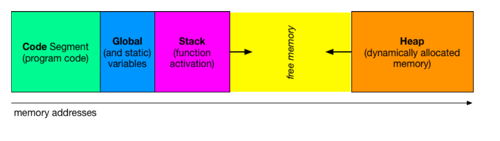

# Riassunto di SDA

## indice


## 01 - Organizzazione della memoria, chiamate di funzioni, ricorsione

### L'organizzazione della memoria



1. **Code segment**
   - Contiene il codice eseguibile del programma, ossia le istruzioni della CPU
   - è un area di sola lettura, per evitare che il codice venga modificato durante l'esecuzione
   - include funzioni, metodi e istruzioni scritte nel programma
   - *esempio* in C contiene il codice compilato dal programma*
2. **Global segment**
   -  Memorizza tutte le variablili globali e statiche del programma
   - le variabili sono allocate una volta sola e persistono per tutta la durata del programma
   - contiene dati sia inizializzati che non
   - *esempio* la variabile int ```x = 5```; verrà memorizzata qui
3. **Stack** 
   - è l'area di memoria utilizzata per la genstione delle chiamate di funzioni e di variabili locali.
   -Cresce 'verso il basso'(verso indirizzi di memoria più bassi)
   - Quando viene chiamata una funzione il suo contesto(variabili Locali, indirizzi di ritorno, ecc.) vengono allocati nello stack
   -*esempio* una variabile locale ```int y = 10``` sarà nello stack.
4. **heap** 
   - è utilizzata per allocare dinamicamente la memoria.
   - è crescente verso l'alto(indirizzi di memoria più alti)
   - l'allocazione e deallocazione è gestita esplicitamente dal programmatore(es.``` malloc/free``` in C)
   - è più flessibile rispetto allo stack, è più lenta ed è più probabile che sia soggetta ad errori come memory leaks
5. **Free memory**
   - è la memoria libera tra lo stack e l'heap
   -se lo stack e l'heap s'incontrano si verifica un' errore di memoria(stack/heap overflow)
   